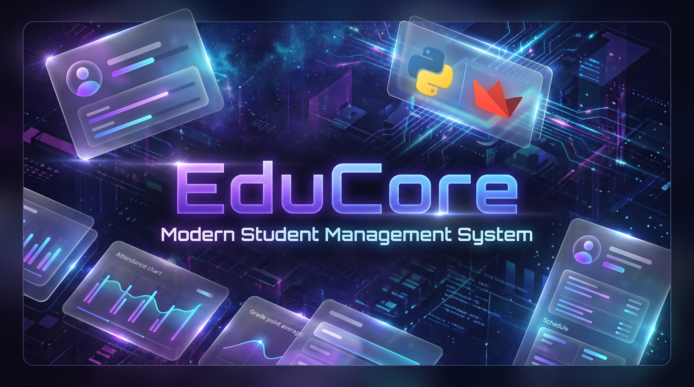
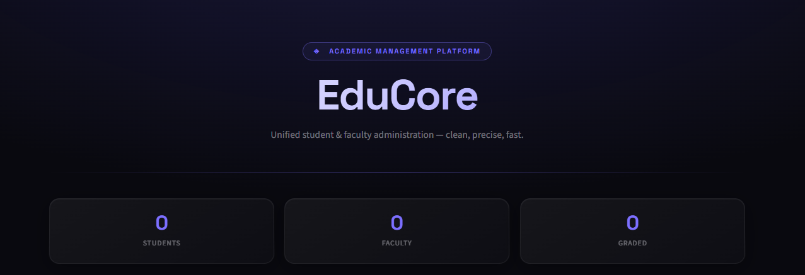
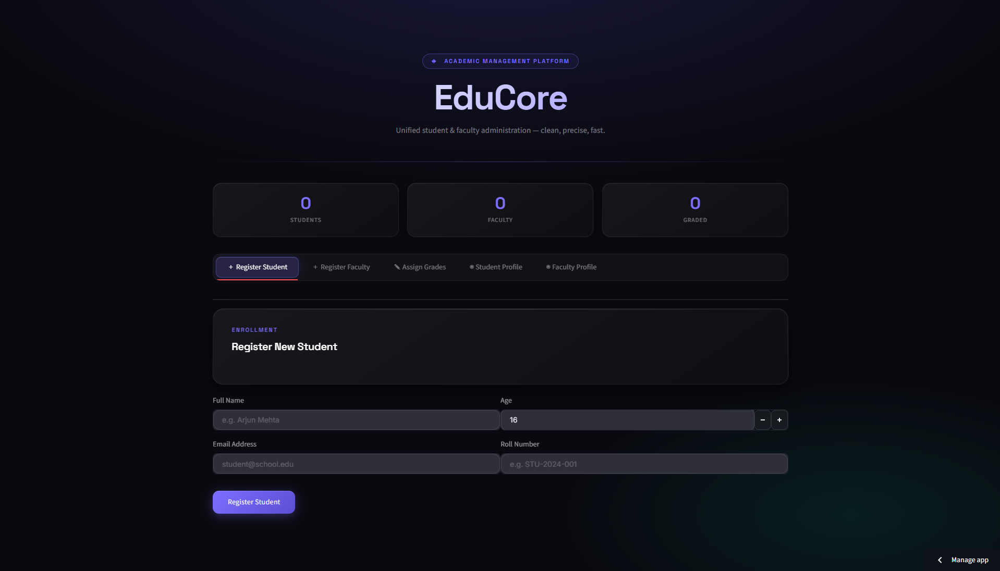
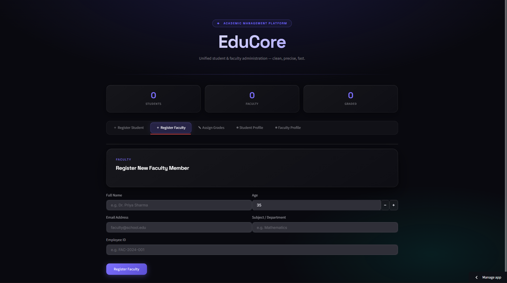

<div align="center">

# 🎓 EduCore

### Modern Student & Faculty Management System

<p>
A beautifully designed <strong>Python + Streamlit</strong> CRUD application for managing students, faculty members, and academic records with a clean modern interface.
</p>



<br>


</div>

---

# ✨ Overview

EduCore is a lightweight academic management system built entirely in Python using Streamlit.

It demonstrates how a modern CRUD application can be built without relying on heavy databases while maintaining a beautiful UI and clean project architecture.

Designed as an educational project, it serves as an excellent starting point for developers learning:

- CRUD Operations
- Data Persistence
- Streamlit Development
- UI Design
- Python Project Structure
- Open Source Collaboration

---

# 🚀 Features

## 👨‍🎓 Student Management

- Register new students
- View student profiles
- Local JSON database
- Duplicate roll number protection
- Email validation

---

## 👨‍🏫 Faculty Management

- Register faculty members
- Department management
- Employee IDs
- Faculty profile page

---

## 📊 Grade Management

- Assign subject grades
- Automatic average calculation
- Student performance overview

---

## 🎨 Modern UI

- Glassmorphism inspired design
- Dark futuristic interface
- Responsive layout
- Interactive dashboard
- Professional animations

---

# 📷 Screenshots

<p align="center">



<br><br>




</p>

---

# ⚙ Installation

### Clone Repository

```bash
git clone https://github.com/Rakshit-Chadgal/EduCore-Management-System.git
```

### Enter Project

```bash
cd EduCore
```

### Install Dependencies

```bash
pip install -r requirements.txt
```

### Run Application

```bash
streamlit run app.py
```

---

# 💻 Tech Stack

<p align="center">


</p>

- Python
- Streamlit
- JSON
- HTML
- CSS

---

# 📈 Roadmap

- [x] Student CRUD
- [x] Faculty CRUD
- [x] Grade Assignment
- [x] Local Database

### Version 2

- [ ] SQLite Support
- [ ] Attendance System
- [ ] Authentication
- [ ] Dashboard Analytics
- [ ] PDF Reports
- [ ] CSV Export
- [ ] Search
- [ ] Student Editing
- [ ] Teacher Editing
- [ ] Delete Records
- [ ] Docker Support
- [ ] REST API
- [ ] AI Performance Prediction

---

# 🤝 Contributing

Contributions are always welcome.

If you'd like to improve EduCore:

1. Fork the repository
2. Create your feature branch
3. Commit your changes
4. Push your branch
5. Open a Pull Request

---

# ⭐ Support

If you found this project helpful,

please consider giving it a ⭐ on GitHub.

It motivates future improvements and helps more developers discover the project.

---

# 📄 License

This project is licensed under the MIT License.

---

<div align="center">

### Built with ❤️ using Python & Streamlit

Designed and Developed by **Rakshit Chadgal**

</div>